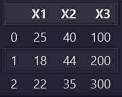
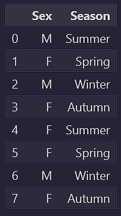

# Data Transformation Techniques Notebook

## Overview

This notebook showcases a variety of **data transformation techniques** typically used in data preprocessing tasks, including **Encoding** and **Normalization** methods. These transformations are crucial for preparing datasets before feeding them into machine learning models.

### Key Transformation Techniques

1. **Encoding**: Applied to discrete/categorical data, transforming them into numeric formats.
2. **Normalization**: Applied to continuous/numeric data, scaling or reshaping values to a specific range.

---
## Libraries & Dependencies

The notebook begins by importing necessary libraries such as `pandas` for data manipulation and various preprocessing tools from `sklearn` for performing transformations.

```python
import pandas as pd
from sklearn.preprocessing import MinMaxScaler, StandardScaler, RobustScaler, QuantileTransformer
from sklearn.preprocessing import OneHotEncoder, OrdinalEncoder
```

## Data Normalization Techniques
***A sample Categorical dataset to demonstrate encoding techniques:***




### `MinMaxScaler()`
This scales numeric values between 0 and 1. It is optimal for uniformly distributed data but sensitive to outliers.

### `StandardScaler()`
Standardizes features by removing the mean and scaling to unit variance. This is best suited for normally distributed data.

### `RobustScaler()`
Uses the median and interquartile range, making it less sensitive to outliers.

### `QuantileTransformer()`
Transforms features into a uniform or normal distribution, making it effective for asymmetric or multimodal data.

## Encoding Categorical Data
***A sample Categorical dataset to demonstrate encoding techniques:***




### `OneHotEncoder() & get_dummies()`
This transforms categorical variables into binary format. Each category is represented as a separate feature.

### `OrdinalEncoder() & LabelEncoder()`
Converts categorical variables into numeric ordinal values.

# Note
The main purpose of this repo is to collect the knowledge & practical examples I've gathered from my **Data-Mining course** during my 2nd year of Software Engineering & Decicional Computing.  
